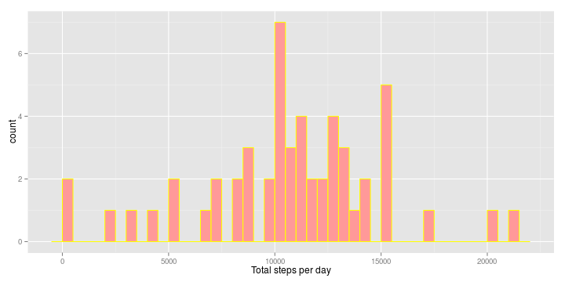
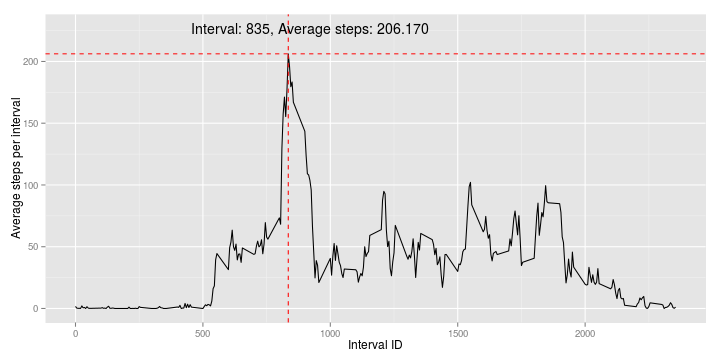
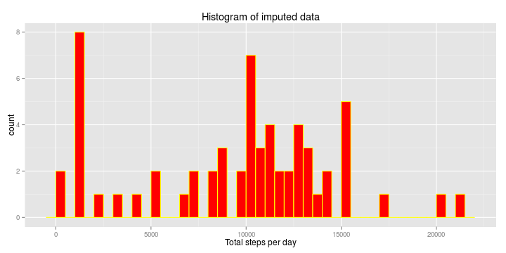
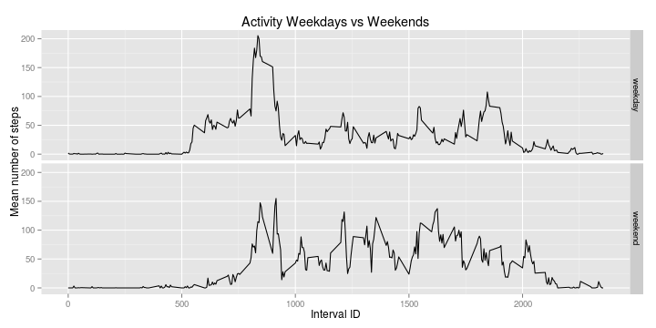

## Loading and preprocessing the data


```r
# Set global option for echoing R code.
opts_chunk$set(echo = TRUE, fig.height = 5, fig.width = 9)
# Load some utility functions
source("UtilityFunctions.R")
```

1. Load the data. 

    Here we first check and download the original zip file if neccessary. Then we unzip and put the data in to `data` variable. However, before that we load `dplyr` library for convenient data manipulation and `ggvis` for plotting.
    
    
    ```r
        # Load some required libraries
        required_package("dplyr")
    ```
    
    ```
    ## 
    ## Attaching package: 'dplyr'
    ## 
    ## The following object is masked from 'package:stats':
    ## 
    ##     filter
    ## 
    ## The following objects are masked from 'package:base':
    ## 
    ##     intersect, setdiff, setequal, union
    ```
    
    ```r
        required_package("ggplot2")
    ```


    
    ```r
    fileUrl <- "https://d396qusza40orc.cloudfront.net/repdata%2Fdata%2Factivity.zip"
    zipfile <- "activity.zip"
    
    if (!file.exists(zipfile)){
        #     This is only tested on Linux which has wget binary
        download.file(url=fileUrl, destfile=zipfile,quiet=TRUE, method="wget")
        }
    unzip(zipfile)
    activitydata <- read.csv("activity.csv")
    # convert to plyr data frame
    activitydata <- tbl_df(activitydata)
    # Simple check on data integrity and reading
    expected_number_of_row <- 17568
    if (nrow(activitydata) != expected_number_of_row) {
        stop("The input data is corrupted. Check and download it again!")
        }
    ```
2. Process/transform data

    I choose not to do it here, because there is not much to do before hand here. 

## What is mean total number of steps taken per day?

We remove rows with missing data on steps column. 

```r
goodcases <- complete.cases(activitydata)
data_no_missing <- filter(activitydata, goodcases)
```

1. Calculate the total number of steps taken per day
    
    ```r
    totalstepsperday <- data_no_missing %>% group_by(date) %>%
        summarise(totalsteps=sum(steps))
    ```
2.  Make a histogram of the total number of steps taken each day
    

```r
    ggplot(totalstepsperday, aes(x = totalsteps)) +
        # set binwidth = 500 meaning that we group all values (i.e. stepsperday)
        # that are different less than or equal 500 to be in the same been, and 
        # make up one bar in the histogram
        geom_histogram(data = totalstepsperday,
                       fill = "#FF9999", col = "yellow", binwidth = 500) +
        xlab("Total steps per day")
```

 

We have: 

1. Mean of total number of steps per day: 10766.189
2. Median of total number of steps per day: 10765 

## What is the average daily activity pattern?

1. The time series plot of the 5-minute interval vs the average number of steps taken.
    
    ```r
    averagestepsperinterval <- data_no_missing %>% group_by(interval) %>%
        summarise(averageperinterval = mean(steps)) %>%
        # Sort the data for later use
        arrange(desc(averageperinterval), desc(interval))
    # Maximum point
    maxpoint <- averagestepsperinterval[1,]
    # Start plotting
    ggplot(averagestepsperinterval, aes(x = interval , y = averageperinterval)) +
        geom_line() + xlab("Interval ID") + ylab("Average steps per interval") +
        #     Add positioning lines if necessary
            geom_hline(yintercept = maxpoint[[1,"averageperinterval"]], col = "red", linetype = 2) +
            geom_vline(xintercept = maxpoint[[1,"interval"]], col = "red", linetype = 2) +
        annotate("text", label = sprintf("Interval: %s, Average steps: %.3f", maxpoint[[1,1]], maxpoint[[1,2]]), 
                 x = 1.1 * maxpoint[[1,1]] , y = 1.1 * maxpoint[[1,2]])
    ```
    
     
    
    ```r
    # Interval ID is constructed the Nth hour followed by the Nth minute. 
    #  So 155 is The 55th minutes of the first hour.
    ```

2. Which 5-minute interval, on average across all the days in the dataset, contains the maximum number of steps?
The answer is simple after we have computed average values and sort themInterval: 835, Average steps at this interval: 206.170

## Imputing missing values

1. Calculate and report the total number of missing values in the dataset (i.e. the total number of rows with NAs)

    Number of rows with missing values: 2304
    
    Number of rows with missing data on "steps" column: 2304

2. Devise a strategy for filling in all of the missing values in the dataset.

    I choose to take a median of steps for the same 5-minute interval to fill in the missing values. Which means, a filled value of steps is not different from the activity at the same interval on any other days. 

3. Create a new dataset that is equal to the original dataset but with the missing data filled in.

    This code chunk also illustrates how to replace a value with another value on the same row, but different column. A kind of Excel's lookup function.

    
    ```r
    # Calculate medians
    medianstepsperinterval <- data_no_missing %>% group_by(interval) %>%
    summarise(medianvalues = median(steps)) 
    # Now lookup and fill
    # Inspired by this question: http://stackoverflow.com/questions/28992362/dplyr-join-define-na-values
    narows <- which(is.na(activitydata$steps))
    imputeddata <- left_join(x = activitydata, y = medianstepsperinterval, by = "interval")%>%
    # Replace NA values in column steps with median value in column 'media'
    mutate(mergeStepsAndMedian = replace(steps, narows, medianvalues[narows])) %>%
    # Reassign steps column to the content of mergeStepsAndMedian, take remaining columns of the oringial dataset. 
    select(steps=mergeStepsAndMedian, date, interval)
    ```

4. Make a histogram of the total number of steps taken each day and Calculate and report the mean and median total number of steps taken per day. 

    
    ```r
    imputedTotalStepsPerDay <- imputeddata %>% group_by(date) %>%
        summarise(totalsteps=sum(steps))
    
    ggplot(imputedTotalStepsPerDay, aes(x = totalsteps)) +
        geom_histogram(data = imputedTotalStepsPerDay,
                       fill = "red", col = "yellow", binwidth = 500) +
        xlab("Total steps per day") + labs(title = "Histogram of imputed data")
    ```
    
     


     Mean total number of steps taken per day:
     **9503.869**. 
     
     Median total number of steps taken per day:
     **10395**
     
     **Before Imputing:**
     
        Mean of total number of steps per day: 10766.189
        
        Median of total number of steps per day: 10765
    
    Do these values differ from the estimates from the first part of the assignment?
    
    **Yes, they do.**
        
    What is the impact of imputing missing data on the estimates of the total daily number of steps?
    
      By filling in the missing data, it changes the results of estimating the total daily steps. In general it would decrease the mean because the mean calculation is spread to more data point. The big question is when to impute and how much can we impute? I still do not have answer to this.
        
## Are there differences in activity patterns between weekdays and weekends?

1. Create a new factor variable in the dataset with two levels ??? "weekday" and "weekend" indicating whether a given date is a weekday or weekend day.

    
    ```r
    weekendOrWeekday <- function(x=vector()){
        dayNames <- strptime(x, format="%Y-%m-%d")
        dayNumbers <- as.numeric(format(dayNames, "%u"))
        weekendWeekday<- factor(dayNumbers <= 5, levels =c(TRUE, FALSE) , labels = c("weekday", "weekend"))
    } 
    stepsPerIntervalByDay <- imputeddata %>% mutate(dayclass = weekendOrWeekday(date)) %>%
        group_by(interval, dayclass) %>% summarise(meansteps=mean(steps))
    ```

2. Make a panel plot containing a time series plot (i.e. type = "l") of the 5-minute interval (x-axis) and the average number of steps taken, averaged across all weekday days or weekend days (y-axis).

    
    ```r
    p <- ggplot(stepsPerIntervalByDay, aes(x = interval, y = meansteps)) + geom_line() 
        
    p +  facet_grid(dayclass ~ .) + ylab("Mean number of steps") + xlab("Interval ID") +
        labs(title = "Activity Weekdays vs Weekends")
    ```
    
     

